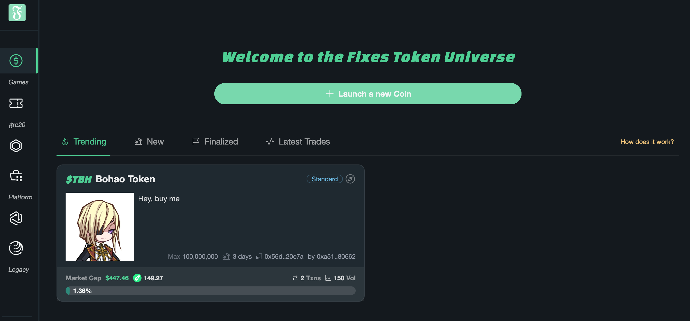

# Guide 1: How to Launch a new Coin?

### Step 1: Click the "Launch a new Coin" button in the landing page

<figure><figcaption>
Step 1
</figcaption></figure>

### Step 2: Input the necessary information for your new Coin

<figure><figcaption>
Step 2
</figcaption></figure>

### Step 3:  Activate the Tradable Pool (Bonding Curve) to make it tradable.

For advanced users (who staked more than 100k $flows), **Advanced** is available for more configuration.

<figure><figcaption>
Step 3
</figcaption></figure>

### Done! That's all. Enjoy trading!

<figure><figcaption>
Done
</figcaption></figure>

